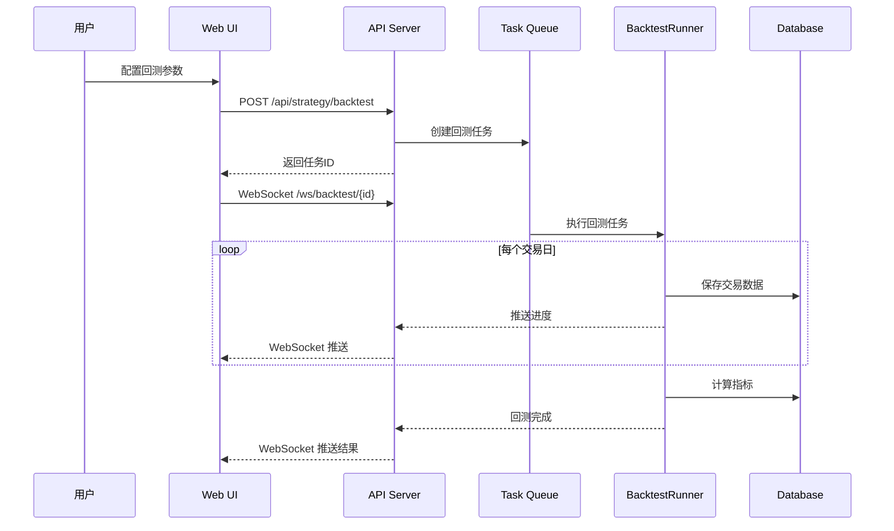
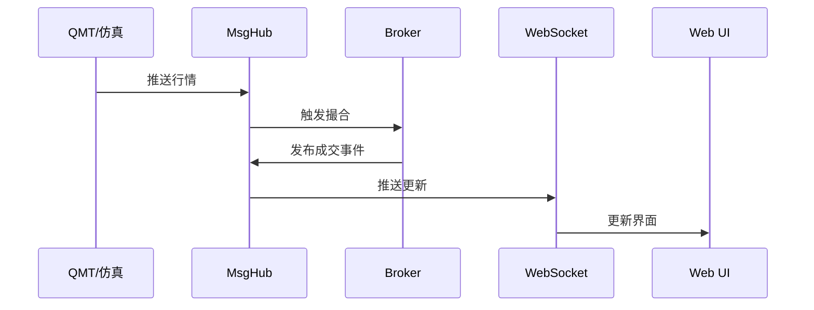

# PyQMT UI 需求与设计文档

## 1. 概述

本文档描述 PyQMT 量化交易系统的 Web UI 需求与设计方案。UI 采用现代化的单页应用（SPA）架构，提供交易、策略管理、数据维护等核心功能。

## 2. 技术栈

- **前端框架**: FastHTML + MonsterUI
- **UI 组件库**: Tailwind CSS
- **图表库**: 用于收益曲线展示（待定，建议使用 Plotly 或 ECharts）
- **后端**: FastAPI (通过 FastHTML 集成)
- **数据库**: SQLite

## 3. 整体布局

### 3.1 页面结构

采用经典的 Header + Sidebar + Main 三栏布局：

```
┌─────────────────────────────────────────────────────────┐
│                        Header                            │
│  [Logo] [Brand]              [一级导航]        [用户头像] │
├──────────┬──────────────────────────────────────────────┤
│          │                                               │
│ Sidebar  │                 Main Content                 │
│          │                                               │
│ [二级菜单]│              (动态内容区域)                   │
│          │                                               │
│          │                                               │
└──────────┴──────────────────────────────────────────────┘
```

### 3.2 Header 设计

Header 从左到右依次为：

1. **Logo**: 系统图标（`/static/logo.png`），点击返回首页
2. **Brand**: 系统名称"匡醍"
3. **空白区域**: 用于视觉平衡
4. **一级导航**: 水平排列的导航菜单
5. **用户头像**: 显示当前登录用户，下拉菜单包含个人设置、退出登录等

#### 一级导航菜单项

| 导航项 | 路由 | 说明 |
|--------|------|------|
| 交易 | `/trade` | 交易相关功能入口 |
| 我的策略 | `/strategy` | 策略管理与回测 |
| 数据和因子 | `/data` | 数据维护与因子库管理 |
| 系统维护 | `/system` | 系统配置与维护 |

### 3.3 Sidebar 设计

Sidebar 根据当前选中的一级导航动态显示二级菜单。每个二级菜单项可展开/折叠。

## 4. 功能模块详细设计

### 4.1 登录与退出

#### 4.1.1 登录页面

**路由**: `/login`

**功能**:
- 用户名/密码登录
- 记住登录状态（可选）
- 登录失败提示

**UI 元素**:
- Logo 和系统名称
- 用户名输入框
- 密码输入框
- 登录按钮
- 错误提示区域

**流程**:
1. 用户输入凭证
2. 系统验证用户身份
3. 成功后跳转至首页（或之前访问的页面）
4. 失败显示错误信息

#### 4.1.2 退出登录

**触发方式**: Header 用户菜单中的"退出"按钮

**流程**:
1. 清除会话信息
2. 跳转至登录页面

### 4.2 交易模块

**一级路由**: `/trade`

#### 4.2.1 二级菜单

| 菜单项 | 路由 | 说明 |
|--------|------|------|
| 仿真 | `/trade/simulation` | 仿真交易账户管理 |
| 实盘 | `/trade/live` | 实盘交易账户管理 |

#### 4.2.2 仿真交易页面

**路由**: `/trade/simulation`

**功能列表**:

1. **账户列表展示**
   - 显示所有仿真账户（Portfolio）
   - 字段：账户ID、名称、创建时间、状态、总资产、收益率
   - 支持搜索、筛选、排序

2. **创建仿真账户**
   - 弹出对话框
   - 输入项：
     - 账户名称（必填）
     - 初始资金（默认 1,000,000）
     - 佣金费率（默认 0.0001）
     - 描述信息（可选）
     - 持仓市值更新间隔（默认 10 秒，可选 3/5/10 秒）

3. **账户详情**
   - 点击账户进入详情页
   - 显示：
     - 账户基本信息
     - 当前持仓列表（资产代码、数量、成本、市值、盈亏）
     - 可用资金
     - 当日订单列表
     - 成交记录

4. **交易操作**
   - 买入：输入资产代码、数量/金额、价格（0 为市价）
   - 卖出：输入资产代码、数量/比例、价格
   - 撤单：取消未成交订单

5. **账户控制**
   - 启动/停止账户
   - 删除账户（需确认）

**UI 布局**:
```
┌─────────────────────────────────────────────────────────┐
│ [创建账户]  [搜索框]                    [筛选] [刷新]   │
├─────────────────────────────────────────────────────────┤
│ 账户列表表格                                             │
│ ┌──────┬────────┬────────┬────────┬────────┬────────┐  │
│ │ ID   │ 名称   │ 总资产  │ 收益率  │ 状态   │ 操作   │  │
│ ├──────┼────────┼────────┼────────┼────────┼────────┤  │
│ │ xxx  │ 策略A  │ 120万  │ +20%   │ 运行中 │ [详情] │  │
│ └──────┴────────┴────────┴────────┴────────┴────────┘  │
└─────────────────────────────────────────────────────────┘
```

#### 4.2.3 实盘交易页面

**路由**: `/trade/live`

**功能**:
- 与仿真交易类似，但连接真实交易柜台（QMT）
- 增加风险提示
- 显示柜台连接状态

**额外功能**:
- 柜台配置：设置 QMT 连接参数
- 同步状态：从柜台同步持仓、资金、订单

### 4.3 我的策略模块

**一级路由**: `/strategy`

#### 4.3.1 二级菜单

| 菜单项 | 路由 | 说明 |
|--------|------|------|
| 策略列表 | `/strategy/list` | 所有策略的管理入口 |

#### 4.3.2 策略列表页面

**路由**: `/strategy/list`

**功能列表**:

1. **策略列表展示**
   - 显示所有策略文件/目录
   - 字段：策略名称、类型、创建时间、最后修改时间、回测次数
   - 支持搜索、筛选

2. **策略操作**
   - **查看**: 在浏览器中查看策略文件内容
   - **编辑**: 打开 VSCode 编辑策略（需要配置 VSCode 路径）
   - **回测**: 弹出回测配置对话框
   - **删除**: 删除策略文件（需确认）

3. **创建新策略**
   - 基于模板创建
   - 或上传策略文件

**UI 布局**:
```
┌─────────────────────────────────────────────────────────┐
│ [新建策略]  [搜索框]                                     │
├─────────────────────────────────────────────────────────┤
│ 策略列表                                                 │
│ ┌────────────┬──────┬──────────┬────────┬────────────┐ │
│ │ 策略名称   │ 类型 │ 修改时间  │回测次数 │   操作     │ │
│ ├────────────┼──────┼──────────┼────────┼────────────┤ │
│ │ dual_ma.py │ 趋势 │ 2024-01-15│   3    │[查看][回测]│ │
│ │ macd/      │ 振荡 │ 2024-01-10│   1    │[查看][回测]│ │
│ └────────────┴──────┴──────────┴────────┴────────────┘ │
└─────────────────────────────────────────────────────────┘
```

#### 4.3.3 回测配置对话框

**触发方式**: 点击策略的"回测"按钮

**配置项**:

| 配置项 | 类型 | 必填 | 默认值 | 说明 |
|--------|------|------|--------|------|
| 开始日期 | Date | 是 | - | 回测起始日期 |
| 结束日期 | Date | 是 | - | 回测结束日期 |
| 初始资金 | Number | 是 | 1,000,000 | 初始资金 |
| 主周期 | Select | 是 | 1d | 1d/5m/1m |
| 策略参数 | Dynamic | 否 | - | 根据策略定义动态生成 |

**策略参数动态生成**:

策略可在代码中声明可配置参数，UI 自动解析并生成输入控件：

```python
class DualMAStrategy(BaseStrategy):
    """双均线策略"""

    # 参数声明（示例）
    PARAMS = {
        "fast": {"type": "int", "default": 5, "desc": "快线周期"},
        "slow": {"type": "int", "default": 10, "desc": "慢线周期"},
        "symbol": {"type": "str", "default": "000001.SZ", "desc": "交易标的"},
        "invest": {"type": "float", "default": 100000, "desc": "每次投入金额"}
    }
```

UI 将自动生成对应的输入控件。

**UI 布局**:
```
┌─────────────────────────────────────────────────────────┐
│ 回测配置 - dual_ma.py                              [×] │
├─────────────────────────────────────────────────────────┤
│ 开始日期:    [2023-01-01]                               │
│ 结束日期:    [2023-12-31]                               │
│ 初始资金:    [1000000]                                  │
│ 主周期:      [1d ▼]                                     │
│                                                         │
│ ─── 策略参数 ───                                        │
│ 快线周期:    [5]                                        │
│ 慢线周期:    [10]                                       │
│ 交易标的:    [000001.SZ]                                │
│ 投入金额:    [100000]                                   │
│                                                         │
│                              [取消]  [开始回测]         │
└─────────────────────────────────────────────────────────┘
```

#### 4.3.4 回测执行与结果展示

**并发执行**:
- 同一策略可启动多个回测任务（不同参数）
- 不同策略的回测任务可并发执行
- 使用任务队列管理回测任务

**实时进度展示**:
- 显示回测进度条
- 显示当前处理日期
- 显示已执行交易数量

**实时收益曲线**:
- 使用 WebSocket 推送实时数据
- 图表显示：
  - 策略收益曲线
  - 对照标的收益曲线（如沪深300）
  - 关键指标实时更新

**UI 布局**:
```
┌─────────────────────────────────────────────────────────┐
│ 回测进行中 - dual_ma.py (fast=5, slow=10)               │
├─────────────────────────────────────────────────────────┤
│ 进度: ████████████░░░░░░░░ 60%  (2023-07-15)           │
│                                                         │
│ ┌─────────────────────────────────────────────────────┐│
│ │                     收益曲线图                       ││
│ │    ___/\___                                        ││
│ │   /        \___          策略收益                   ││
│ │  /              \___    ---- 基准收益               ││
│ │ /                    \___                          ││
│ │─────────────────────────────────────────────────    ││
│ └─────────────────────────────────────────────────────┘│
│                                                         │
│ ┌─────────────────────────────────────────────────────┐│
│ │ 关键指标                                             ││
│ │ 总收益率: +25.6%    年化收益: +28.3%                ││
│ │ 最大回撤: -8.2%     夏普比率: 1.85                  ││
│ │ 胜率: 62.5%         盈亏比: 2.1                     ││
│ └─────────────────────────────────────────────────────┘│
│                                                         │
│                              [暂停]  [取消]             │
└─────────────────────────────────────────────────────────┘
```

#### 4.3.5 历史回测结果查看

**路由**: `/strategy/results`

**功能**:
- 显示所有历史回测记录
- 支持按策略、日期范围筛选
- 点击可查看详细的回测报告

**回测报告内容**:
1. 收益曲线图
2. 详细指标（使用 quantstats 计算）
3. 交易记录列表
4. 持仓变化历史
5. 资金变化曲线

**UI 布局**:
```
┌─────────────────────────────────────────────────────────┐
│ 回测结果列表                        [筛选] [导出]        │
├─────────────────────────────────────────────────────────┤
│ ┌──────────┬────────┬──────────┬────────┬────────────┐ │
│ │ 策略名称 │ 参数   │ 回测时间  │ 收益率  │   操作     │ │
│ ├──────────┼────────┼──────────┼────────┼────────────┤ │
│ │ dual_ma  │ 5/10   │ 2024-01-15│ +25.6% │ [查看][删除]│ │
│ │ dual_ma  │ 10/20  │ 2024-01-14│ +18.2% │ [查看][删除]│ │
│ └──────────┴────────┴──────────┴────────┴────────────┘ │
└─────────────────────────────────────────────────────────┘
```

### 4.4 数据和因子模块

**一级路由**: `/data`

#### 4.4.1 二级菜单

| 菜单项 | 路由 | 说明 |
|--------|------|------|
| 日线数据 | `/data/daily` | 日线数据管理 |
| 因子库 | `/data/factors` | 因子数据管理 |
| 数据概览 | `/data/overview` | 数据统计与质量检查 |

#### 4.4.2 日线数据管理

**路由**: `/data/daily`

**功能**:

1. **数据下载配置**
   - 设置自动下载时间（cron 表达式）
   - 选择数据源（tushare 等）
   - 配置 API token

2. **手动下载**
   - 选择日期范围
   - 选择股票范围（全部/自选）
   - 执行下载

3. **数据查看**
   - 查看已下载数据的日期范围
   - 数据量统计
   - 预览数据样本

**UI 布局**:
```
┌─────────────────────────────────────────────────────────┐
│ 日线数据管理                                             │
├─────────────────────────────────────────────────────────┤
│ ┌─ 自动下载配置 ───────────────────────────────────────┐│
│ │ 启用自动下载: [✓]                                     ││
│ │ 下载时间:    [09:00] (每日)                          ││
│ │ 数据源:      [tushare ▼]                             ││
│ │                                      [保存配置]      ││
│ └──────────────────────────────────────────────────────┘│
│                                                         │
│ ┌─ 手动下载 ───────────────────────────────────────────┐│
│ │ 开始日期: [2023-01-01]  结束日期: [2023-12-31]       ││
│ │ 股票范围: [○ 全部  ○ 自选股]                         ││
│ │                                      [开始下载]      ││
│ └──────────────────────────────────────────────────────┘│
│                                                         │
│ ┌─ 数据概览 ───────────────────────────────────────────┐│
│ │ 已下载数据: 2020-01-01 ~ 2024-01-15                  ││
│ │ 股票数量: 5,234 只                                   ││
│ │ 数据大小: 2.3 GB                                     ││
│ └──────────────────────────────────────────────────────┘│
└─────────────────────────────────────────────────────────┘
```

#### 4.4.3 因子库管理

**路由**: `/data/factors`

**功能**:

1. **因子更新配置**
   - 设置自动更新时间
   - 选择需要更新的因子

2. **因子列表**
   - 显示所有可用因子
   - 因子计算状态
   - 最后更新时间

3. **手动计算**
   - 选择因子
   - 选择日期范围
   - 执行计算

#### 4.4.4 数据概览与质量检查

**路由**: `/data/overview`

**功能**:

1. **数据统计**
   - 各类数据的时间范围
   - 数据量统计
   - 存储空间占用

2. **数据质量检查**
   - 缺失数据检测
   - 异常数据检测
   - 数据一致性检查

3. **问题数据列表**
   - 显示缺失的交易日数据
   - 显示异常数据详情
   - 提供修复建议

**UI 布局**:
```
┌─────────────────────────────────────────────────────────┐
│ 数据概览                                                 │
├─────────────────────────────────────────────────────────┤
│ ┌─ 数据统计 ───────────────────────────────────────────┐│
│ │ 日线数据:   2020-01-01 ~ 2024-01-15  (5,234 只股票)  ││
│ │ 涨跌停数据: 2020-01-01 ~ 2024-01-15                   ││
│ │ 因子数据:   2021-06-01 ~ 2024-01-15  (12 个因子)     ││
│ └──────────────────────────────────────────────────────┘│
│                                                         │
│ ┌─ 数据质量 ───────────────────────────────────────────┐│
│ │ ✅ 日线数据完整性: 99.8%                              ││
│ │ ⚠️  缺失交易日: 3 天                                  ││
│ │    - 2023-05-02 (五一调休)                           ││
│ │    - 2023-10-06 (国庆调休)                           ││
│ │    - 2024-01-10 (数据未更新)                         ││
│ │                                      [立即修复]      ││
│ └──────────────────────────────────────────────────────┘│
└─────────────────────────────────────────────────────────┘
```

### 4.5 系统维护模块

**一级路由**: `/system`

#### 4.5.1 二级菜单

| 菜单项 | 路由 | 说明 |
|--------|------|------|
| 交易日历 | `/system/calendar` | 交易日历管理 |
| 计划任务 | `/system/jobs` | 定时任务管理 |
| 数据库管理 | `/system/db` | 数据库备份与恢复 |
| 配置管理 | `/system/config` | 系统配置 |
| 用户管理 | `/system/users` | 用户账号管理 |

#### 4.5.2 交易日历管理

**路由**: `/system/calendar`

**功能**:
- 查看交易日历
- 标记特殊交易日（节假日、调休）
- 同步交易所日历

#### 4.5.3 计划任务管理

**路由**: `/system/jobs`

**功能**:
- 查看所有定时任务
- 启用/禁用任务
- 手动触发任务
- 查看任务执行历史

**预设任务**:
- 日线数据下载
- 因子计算更新
- 收盘快照
- 数据备份

**UI 布局**:
```
┌─────────────────────────────────────────────────────────┐
│ 计划任务管理                                             │
├─────────────────────────────────────────────────────────┤
│ ┌──────────────┬─────────┬────────┬────────┬──────────┐│
│ │ 任务名称     │ 调度时间 │ 状态   │上次执行 │   操作   ││
│ ├──────────────┼─────────┼────────┼────────┼──────────┤│
│ │ 日线数据下载 │ 09:00   │ ● 启用 │ 成功   │[编辑][禁用]││
│ │ 因子更新     │ 18:00   │ ● 启用 │ 成功   │[编辑][禁用]││
│ │ 数据备份     │ 02:00   │ ● 启用 │ 成功   │[编辑][禁用]││
│ └──────────────┴─────────┴────────┴────────┴──────────┘│
└─────────────────────────────────────────────────────────┘
```

#### 4.5.4 数据库管理

**路由**: `/system/db`

**功能**:
- 数据库大小统计
- 手动备份
- 恢复备份
- 清理历史数据

#### 4.5.5 配置管理

**路由**: `/system/config`

**功能**:
- 查看和修改系统配置
- 配置项分组展示
- 配置验证

**配置分组**:
- 数据源配置（tushare token 等）
- 交易配置（佣金费率、涨跌停限制等）
- 系统配置（日志级别、端口等）

#### 4.5.6 用户管理

**路由**: `/system/users`

**功能**:
- 用户列表
- 添加/删除用户
- 修改密码
- 权限管理

## 5. API 设计

### 5.1 认证相关

| 接口 | 方法 | 说明 |
|------|------|------|
| `/api/auth/login` | POST | 用户登录 |
| `/api/auth/logout` | POST | 用户登出 |
| `/api/auth/current` | GET | 获取当前用户信息 |

### 5.2 交易相关

| 接口 | 方法 | 说明 |
|------|------|------|
| `/api/broker/portfolios` | GET | 获取账户列表 |
| `/api/broker/portfolio` | POST | 创建账户 |
| `/api/broker/portfolio/{id}` | GET | 获取账户详情 |
| `/api/broker/portfolio/{id}` | DELETE | 删除账户 |
| `/api/broker/buy` | POST | 买入 |
| `/api/broker/sell` | POST | 卖出 |
| `/api/broker/cancel` | POST | 撤单 |

### 5.3 策略相关

| 接口 | 方法 | 说明 |
|------|------|------|
| `/api/strategy/list` | GET | 获取策略列表 |
| `/api/strategy/{name}` | GET | 获取策略详情 |
| `/api/strategy/backtest` | POST | 启动回测 |
| `/api/strategy/backtest/{id}/status` | GET | 获取回测状态 |
| `/api/strategy/backtest/{id}/stop` | POST | 停止回测 |
| `/api/strategy/results` | GET | 获取回测结果列表 |
| `/api/strategy/result/{id}` | GET | 获取回测详情 |

### 5.4 数据相关

| 接口 | 方法 | 说明 |
|------|------|------|
| `/api/data/daily/status` | GET | 获取日线数据状态 |
| `/api/data/daily/download` | POST | 下载日线数据 |
| `/api/data/factors/list` | GET | 获取因子列表 |
| `/api/data/factors/calculate` | POST | 计算因子 |
| `/api/data/overview` | GET | 数据概览 |

### 5.5 系统相关

| 接口 | 方法 | 说明 |
|------|------|------|
| `/api/system/jobs` | GET | 获取任务列表 |
| `/api/system/jobs/{id}/toggle` | POST | 启用/禁用任务 |
| `/api/system/jobs/{id}/run` | POST | 手动执行任务 |
| `/api/system/config` | GET/PUT | 获取/更新配置 |
| `/api/system/db/backup` | POST | 备份数据库 |

### 5.6 WebSocket 接口

| 端点 | 说明 |
|------|------|
| `/ws/backtest/{id}` | 回测实时数据推送 |
| `/ws/quote` | 实时行情推送 |

## 6. 数据流设计

### 6.1 回测执行流程



### 6.2 实时行情推送流程



## 7. 安全设计

### 7.1 认证与授权

- 使用 Session-based 认证
- 密码使用 bcrypt 加密存储
- 敏感操作需要二次确认

### 7.2 权限控制

- 基于角色的访问控制（RBAC）
- 角色：管理员、普通用户
- 管理员可访问所有功能
- 普通用户只能访问自己的策略和账户

### 7.3 数据安全

- API Token 等敏感配置加密存储
- 数据库定期备份
- 操作日志记录

## 8. 性能优化

### 8.1 前端优化

- 使用分页加载大数据列表
- 图表数据按需加载
- WebSocket 连接池管理

### 8.2 后端优化

- 回测任务异步执行
- 数据库查询优化（索引）
- 缓存常用数据（交易日历、股票列表）

## 9. 部署方案

### 9.1 开发环境

```bash
# 启动开发服务器
python -m pyqmt.app
```

### 9.2 生产环境

- 使用 Gunicorn + Uvicorn
- Nginx 反向代理
- HTTPS 支持

## 10. 后续扩展

### 10.1 v0.2 规划

- 策略对比功能
- 参数优化（网格搜索）
- 实盘跟单

### 10.2 v0.3 规划

- 多用户支持
- 策略分享
- 社区功能

## 11. 附录

### 11.1 策略参数声明规范

策略可通过类属性 `PARAMS` 声明可配置参数：

```python
class MyStrategy(BaseStrategy):
    """策略示例"""
    
    PARAMS = {
        "param_name": {
            "type": "int|float|str|bool|select",
            "default": default_value,
            "desc": "参数描述",
            "options": ["option1", "option2"],  # 仅 select 类型需要
            "min": 0,  # 仅数值类型
            "max": 100,  # 仅数值类型
        }
    }
```

### 11.2 回测指标说明

| 指标 | 说明 |
|------|------|
| 总收益率 | 回测期间的总收益百分比 |
| 年化收益率 | 换算为年度的收益率 |
| 最大回撤 | 从峰值到谷值的最大跌幅 |
| 夏普比率 | 风险调整后收益 |
| 胜率 | 盈利交易占比 |
| 盈亏比 | 平均盈利/平均亏损 |

### 11.3 数据字典

详细的数据表结构请参考 [brokers.md](brokers.md) 文档。
