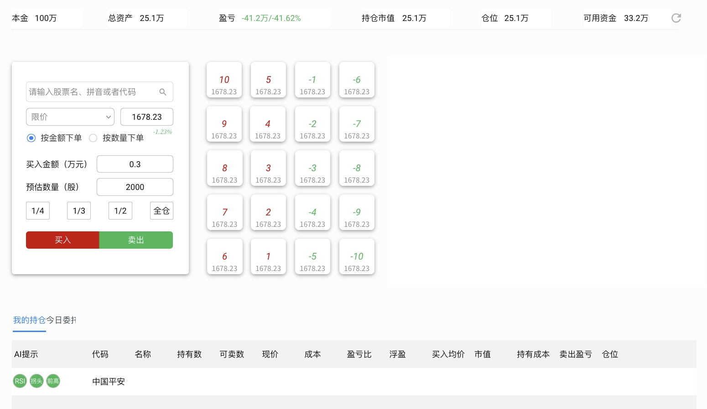

features/gateway分支用来进行一个重构。它的来源是main分支。在main分支，我们实现了量化交易框架的基本功能，但还没有完全跑通，就出现了重构的需要。

重构的目标是，从主体pyqmt中分离出qmt-gateway。qmt-gateway(以下称gateway)的主要功能是对接 xtquant，订阅实时行情，通过重采样提供实时的分钟线、30分钟线和日线行情，并且通过 websocket 将这些行情广播出去。

将 xtquant.xttrader 的功能封装成一个REST API服务，向 web 客户端提供资金、持仓和交易等服务。

将这部分功能从 pyqmt 分离出来的原因是，它们依赖于 xtquant，只能运行在安装了 QMT 的 windows 机器上，给开发带来不便。另外，这种封装也减少了主体工程对 xtquatn 的依赖，使得未来主体工程可以更容易对接其它接口。

 

这是一个重构，在重构过程中，我们要大量参考主体工程(在pyqmt/pyqmt 目录下）。

## 功能和技术栈

1. fasthtml + monster UI, 使用与主体完全一样的主题
2. 订阅实时行情数据，合成为1分钟, 30分钟和日线，再通过 ws 进行发布。
3. 通过rest api 来接收客户端的交易请求，相当于把 qmt broker （主体工程中有）的能力接口化。
4. 提供初始化界面(init-wizard)，让用户设置管理员、QMT 路径等
5. 提交交易界面，以便用户临时用以交易。
6. 使用poetry管理依赖，使用pytest, ruff, black

## sprint 1

### header和登录 

1. UI 使用与主体完全一样的主题，但header 部分没有导航、alarm。在 user avatar 处，要有一个退出登录的菜单。
2. 提供登录界面

### 初始化向导增强

在初始化向导（init-wizard）中，除了现有的管理员设置、服务器设置和QMT配置外，还需要增加**本金设置**步骤。用户可以在初始化过程中设置初始本金金额，该金额将作为账户的起始资金。

在 user avatar 的下拉菜单中，除了"退出登录"选项外，还需要增加一个"修改本金"的功能。点击该选项后，应弹出一个对话框，显示当前本金金额，允许用户修改本金值。修改后的本金应保存到 Asset 表格中，并且记录日期应为当前交易日。

### 交易界面

如图

所示持仓市值与仓位重复了，去掉持仓位。在持仓市值和可用资金显示上，都先显示金额，再显示占比。

在持仓中，去年AI提示这一列。

下单界面右侧有一个speed dial界面，意味着对应个股上涨百分比之后的价格。当用户直接点击时，价格会填充到左边的限价输入框中（同时切换为限价订单）。如果用户同时按下ctrl/cmd键，则意味着在当前价格基础上增加/减少对应的百分比。
为实现此功能，你需要先调用xtquant获取股票列表，获得所有股票的昨收价格。

**股票搜索（模糊匹配）**

在股票代码输入框中，用户可以通过以下方式进行搜索：

1. **输入即搜索** - 输入框支持实时搜索（200ms防抖），随着用户输入自动向后端发送搜索请求
2. **多维度匹配** - 支持按股票代码、股票名称、拼音首字母进行模糊匹配
   - 代码匹配：输入 "000001" 可找到 "平安银行"
   - 名称匹配：输入 "平安" 可找到 "平安银行"
   - 拼音匹配：输入 "payh" 或 "pa" 可找到 "平安银行"
3. **下拉选择** - 搜索结果以下拉列表形式展示，显示股票名称、代码和拼音
4. **自动填充** - 点击下拉列表中的选项，或当搜索结果唯一时，自动将股票信息填充到输入框（格式："股票名称 (代码)"），同时更新价格输入框和 Speed Dial

**下单表单交互逻辑**

1. **Speed Dial 初始化** - 未选中股票时，Speed Dial 只显示涨跌百分比（如 10, 5, -1 等），不显示具体价格。选中股票后，根据昨收价格计算并显示各档位价格

2. **订单类型** - 默认显示为"限价单"，支持切换为其他类型（参考 xtconstant 中的订单类型常量）

3. **买入金额与预估数量联动**
   - 初始状态：买入金额输入框和预估数量输入框均为空白
   - 联动规则：
     - 当用户在"买入金额"输入框输入金额（万元）后，根据当前股价自动计算并更新"预估数量"（股数）
     - 当用户在"预估数量"输入框输入股数后，根据当前股价自动计算并更新"买入金额"
   - 计算公式：`数量 = 金额(元) / 股价`，`金额(万元) = 数量 * 股价 / 10000`

当用户在持仓界面双击某行时，将自动把该股填充到下单界面上，转换为卖出订单。

**委托单交互功能**

当用户在委托单界面双击某行委托单时，应弹出确认对话框，让用户确认是否取消该委托单。对话框应显示委托单的详细信息（股票代码、名称、委托价格、委托数量、委托方向等），并提供"确认取消"和"取消"两个按钮选项。

## sprint 2（新增需求）

### 历史分钟线下载 API

新增需求：通过 REST API 提供历史分钟线下载能力。该能力与实时 WS 行情能力分离，目标是面向历史数据分发。

1. 数据范围：历史分钟线不包含当天实时数据，默认只允许下载历史交易日。
2. 数据粒度：首期支持 1 分钟线（`period=1m`）。
3. 下载范围：按交易日下载全市场股票分钟数据（默认沪深A股）。
4. 接口形态：采用任务式下载接口，避免大数据量同步阻塞。
5. 输出格式：使用 pyarrow 导出（Parquet）。
6. 运行前提：在 qmt 环境中运行，并确保 `C:\apps` 进入 xtquant 路径解析链路。

### 历史分钟线下载 API 签名

1. `POST /api/history/minutes/jobs`
   - 参数：`trade_date`（`YYYY-MM-DD`，必填）、`period`（默认`1m`）、`universe`（默认`ashare`）
   - 语义：创建下载任务
2. `GET /api/history/minutes/jobs/{job_id}`
   - 语义：查询任务状态与进度
3. `GET /api/history/minutes/jobs/{job_id}/file`
   - 语义：下载任务产物文件（Parquet）
